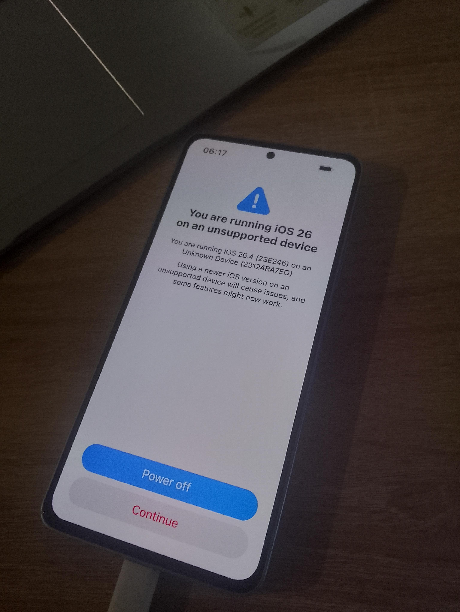

<h1 align="center">
  
</h1>

<strong>Helping you build and run iOS 26.4 (especially 23E246).</strong>

> [!IMPORTANT]
> happy april foolz!! this repo was only made for april fools yea

> [!CAUTION]
> Your warranty is now void.
I am not responsible for bricked devices, dead SD cards, thermonuclear war,
or you getting fired because the alarm app failed.
Please do some research if you have any concerns about features included in this ROM before flashing it!
YOU are choosing to make these modifications, and if you point the finger at me for messing up your device,
I will laugh at you. 

<h1>Prerequisites:</h1>

<strong>1. Device with macOS (or virtual machine with macOS Sequoia or higher) with at least 8 GB RAM</strong> <strong>2. brew, qemu(-full;-aarch64), android-tools, android-studio, python installed</strong> <strong>3. iTunes</strong>

<h1>Tested IPSW's:</h1>
<strong>1. iOS 26.4 (23E246) for iPhone 17 (iPhone18,3 23E246, photo by <a href="https://github.com/ks51s">KS51</a>)</strong>

  

<h1>Installation:</h1>

<strong>1. Environment Setup</strong>
 Clone the repository and ensure all binary blobs are present in the root directory: 
<strong>1) git clone https://github.com/ks51s/ProjectSapphire.git</strong> 
<strong>2) cd ProjectSapphire</strong> 
<strong>3) Place IPSW in ProjectSapphire Folder</strong> 
<strong>4) chmod +x IPSW_INSTALLER.command</strong> 
<strong>5) Run patcher.py</strong> 
<strong>6) Run IPSW_DARWIN_INST.command</strong> 

# Contributing

We welcome contributions to the ProjectSapphire. Please follow these guidelines:

1. **Kernel Patches:** All patches must be submitted in `.EFD` format or as a standard Linux kernel diff.
2. **Coding Style:** Follow the Apple XNU coding style for kernel-space and the Linux kernel coding style for drivers.
3. **Pull Requests:** Ensure your PR includes a detailed log of the `kext` symbols you've mapped. 
4. **Hardware Testing:** Only test on **Xiaomi Redmi Note 13 4G / 4G NFC (sapphire / sapphiren)** with an unlocked bootloader.
